# ⚽ Soccer Game - Мобильная Футбольная Игра

Мобильная игра в футбол, разработанная на Swift с использованием SpriteKit. Игра представляет собой аркадный футбольный симулятор с видом сверху, где игрок соревнуется против ИИ.

## 🎮 Описание игры

**Soccer Game** - это увлекательная мобильная игра, в которой вы управляете футболистом и соревнуетесь с искусственным интеллектом. Цель игры - забить больше голов, чем ваш противник, за отведенное время.

### Основные особенности:
- **12 уровней** с возрастающей сложностью
- **Система звездного рейтинга** за прохождение уровней
- **Специальная способность** - заморозка противника
- **Интуитивное управление** сенсорными жестами
- **Красивая графика** и анимации
- **Система прогрессии** с разблокировкой уровней

## 🎯 Геймплей

### Управление
- **Сенсорное управление**: Перемещайте палец по экрану, чтобы управлять своим игроком
- **Кнопка заморозки**: Используйте специальную способность для временной заморозки противника (1-2 секунды)

### Цели игры
- Забить указанное количество голов до истечения времени
- Каждый уровень имеет свою цель по количеству голов и временное ограничение
- Побеждает тот, кто первым достигнет цели

### Система уровней
| Уровень | Цель (голов) | Время (сек) |
|---------|-------------|-------------|
| 1-4     | 2-5         | 45          |
| 5       | 4           | 40          |
| 6       | 3           | 30          |
| 7       | 5           | 40          |
| 8-9     | 2-3         | 25          |
| 10-11   | 5-6         | 35          |
| 12      | 10          | 50          |

#### 🎮 GameScene (Основная игровая логика)
- Управление игровыми объектами (игроки, мяч, ворота)
- Физика и коллизии
- Таймер и система очков
- ИИ противника
- Специальные способности

#### 📊 LevelManager (Система прогрессии)
- Сохранение прогресса игрока
- Разблокировка уровней
- Управление результатами уровней
- Персистентное хранение данных

#### 🎨 UI Контроллеры
- **LoadViewController**: Анимированный экран загрузки с прыгающим мячом
- **MenuViewController**: Выбор уровней с системой звезд
- **Win/LoseViewController**: Экраны результатов с возможностью повтора или перехода в меню
- **Instruction Controllers**: Обучающие экраны для новых игроков

## 🎨 Визуальные элементы

### Игровое поле
- Зеленое футбольное поле с белой разметкой
- Два футбольных ворот (верх и низ экрана)
- Клетчатая текстура газона для глубины

### Игровые персонажи
- **Игрок (YOU)**: Синий игрок, управляемый пользователем
- **ИИ противник**: Красный игрок с искусственным интеллектом
- **Анимации**: Оба игрока имеют анимированные спрайты

### UI элементы
- **Табло счета**: Показывает счет игрока, ИИ и оставшееся время
- **Кнопка паузы**: Синий квадрат с двумя вертикальными линиями
- **Кнопка заморозки**: Специальная способность с иконкой льда
- **Звездная система**: Оценка прохождения уровней

## 📸 Галерея скриншотов

### 🎮 Игровые экраны

#### Главное меню
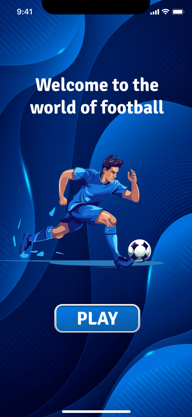
*Приветственный экран с футболистом и кнопкой "PLAY"*

#### Экран загрузки
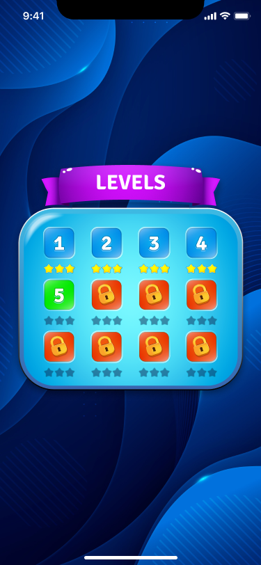
*Анимированный экран загрузки с прыгающим мячом и футболистом*

#### Выбор уровней
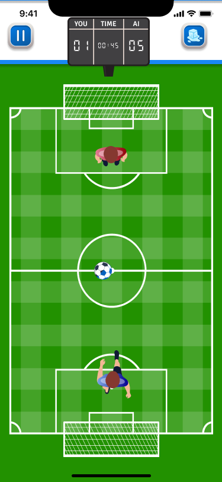
*Меню выбора уровней с системой звезд и заблокированными уровнями*

#### Игровой процесс
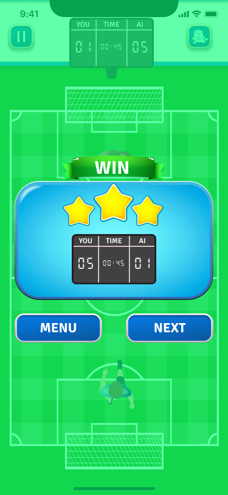
*Основной игровой экран с видом сверху на футбольное поле*

### 🎯 Обучающие экраны

#### Обучение управлению
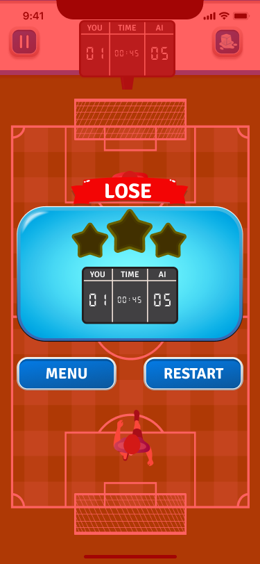
*Объяснение сенсорного управления персонажем*

#### Обучение табло
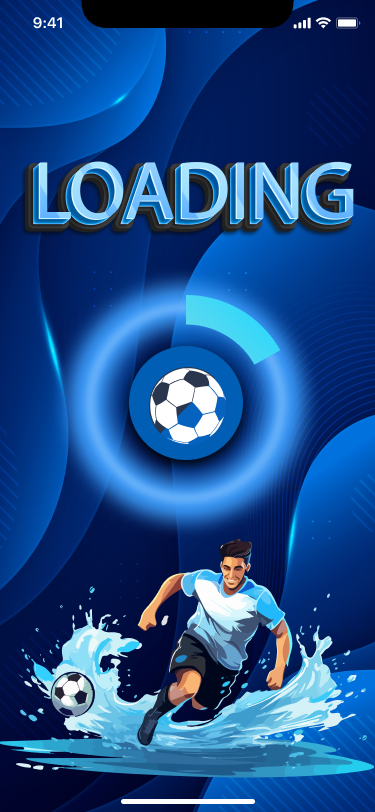
*Объяснение системы подсчета очков и времени*

#### Обучение способностям
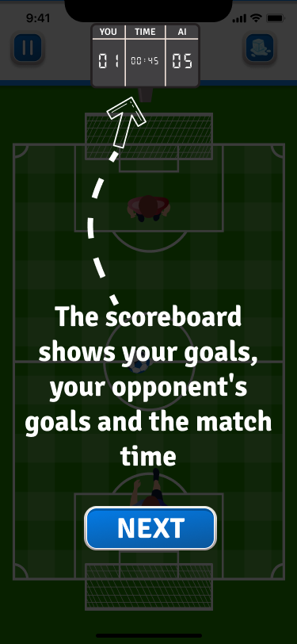
*Объяснение специальной способности заморозки*

#### Описание уровня
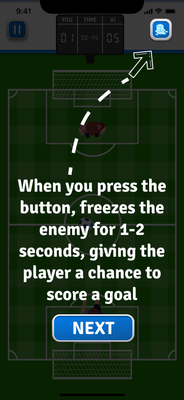
*Информация о целях и условиях прохождения уровня*

### 🏆 Экраны результатов

#### Экран победы
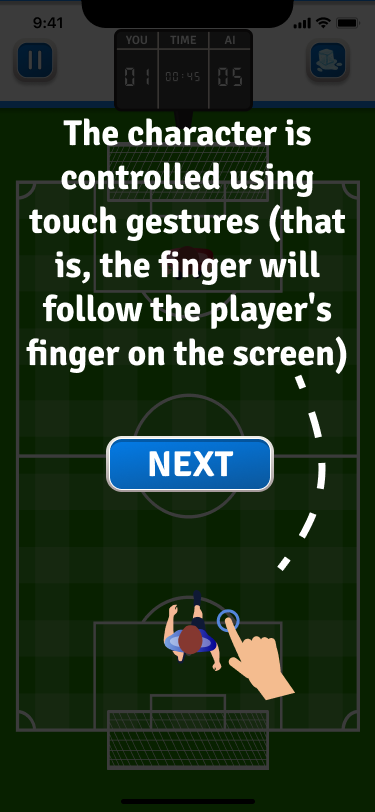
*Экран победы с тремя звездами и результатами матча*

#### Экран поражения
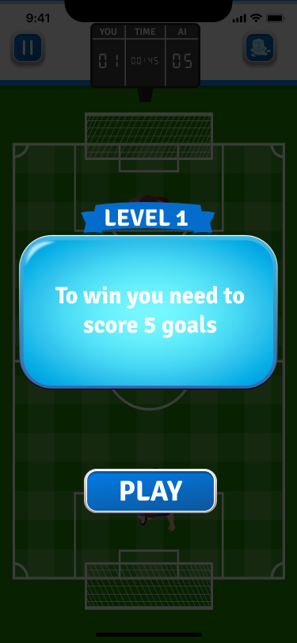
*Экран поражения с возможностью повтора или возврата в меню*

#### Дополнительный экран
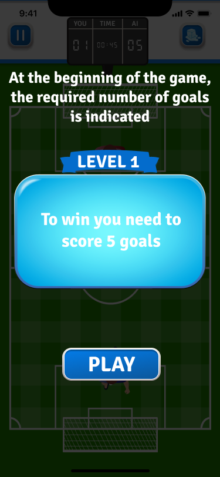
*Дополнительный игровой экран или интерфейс*

### 📁 Структура изображений

#### 🎮 Игровые спрайты
- **Игроки**: `playerImage1.png`, `playerImage2.png`, `playerImage3.png` (анимация игрока)
- **Противник**: `redPlayerImage1.png`, `redPlayerImage2.png`, `redPlayerImage3.png` (анимация ИИ)
- **Мяч**: `ball.png` (футбольный мяч)
- **Поле**: `fieldGame.png`, `fieldBG.png` (текстуры игрового поля)

#### 🎨 UI элементы
- **Фоны**: `LoadingBG.png`, `LevelsBG.png` (фоновые изображения)
- **Кнопки**: `freezeButton.png` (кнопка заморозки)
- **Табло**: `scoreBG.png` (фон табло счета)
- **Уровни**: `LevelButtonBG.png`, `LockLevel.png` (кнопки уровней)
- **Звезды**: `PaintedStar.png`, `UnPaintedStar.png` (система рейтинга)

#### 🎭 Персонажи и анимации
- **Футболист**: `Footbolmen.png` (иллюстрация футболиста)
- **Загрузка**: `Loading 1.png` (анимация загрузки)

### Требования к изображениям
- **Формат**: PNG (рекомендуется для прозрачности)
- **Разрешение**: Оптимизировано для мобильных устройств
- **Размер**: Соответствует дизайну интерфейса
- **Именование**: Использовать точные имена файлов, указанные в коде

### Добавление новых изображений
1. Поместите изображения в папку `ImgProject/`
2. Добавьте их в Xcode проект через "Add Files to Project"
3. Убедитесь, что изображения включены в target приложения
4. Обновите код для использования новых изображений

## 🚀 Технические особенности

### Используемые технологии
- **Swift** - основной язык разработки
- **SpriteKit** - игровой движок для 2D графики
- **UIKit** - пользовательский интерфейс
- **UserDefaults** - локальное хранение данных
- **Timer** - игровые таймеры

### Система сохранений
- Автоматическое сохранение прогресса
- Разблокировка уровней по мере прохождения
- Сохранение результатов каждого уровня
- Персистентность между сессиями

### Оптимизация
- Эффективная система анимаций
- Оптимизированная физика
- Плавное управление сенсорными жестами

## 🎯 Особенности геймплея

### Система обучения
- **Первый уровень**: Полное обучение основам игры
- **Пошаговые инструкции**: Объяснение каждого элемента интерфейса
- **Интерактивные подсказки**: Визуальные указатели и стрелки

### Специальные способности
- **Заморозка противника**: Временная остановка ИИ на 1-2 секунды
- **Стратегическое использование**: Помогает в сложных ситуациях

### Система наград
- **Звездный рейтинг**: Оценка прохождения каждого уровня
- **Прогрессия**: Разблокировка новых уровней
- **Достижения**: Отслеживание успехов игрока

## 🎨 Кастомизация

### Добавление новых уровней
Отредактируйте массив `levels` в файле `Data/Levels.swift`:
```swift
Level(levelNumber: 13, targetScore: 7, timeLimit: 45)
```

### Изменение игровых параметров
Настройте константы в `Data/Constant.swift`:
```swift
var moveSpeed = 175.0  // Скорость движения игрока
var timeLeft = 45      // Время по умолчанию
```

### Добавление новых шрифтов
Поместите файлы шрифтов в папку `MainDetails/Fonts/` и добавьте их в Info.plist.

## 📄 Лицензия

Этот проект разработан в образовательных целях.

## 👨‍💻 Разработка

Проект демонстрирует:
- Современные практики iOS разработки
- Использование SpriteKit для 2D игр
- Архитектуру MVC
- Систему управления состоянием
- Персистентное хранение данных
- Создание интуитивного пользовательского интерфейса

---

**Удачной игры! ⚽🎮** 
